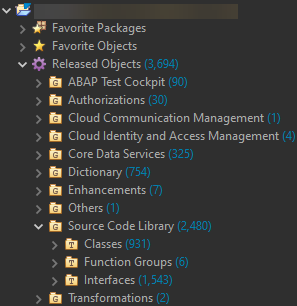
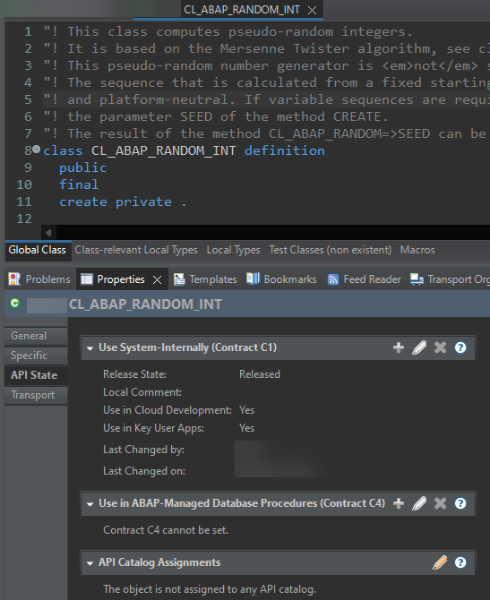

<a name="top"></a>

# ABAP for Cloud Development

- [ABAP for Cloud Development](#abap-for-cloud-development)
- [Terms](#terms)
- [Excursions](#excursions)
- [More Information](#more-information)
- [Executable Example](#executable-example)


This ABAP cheat sheet briefly touches on the terms ABAP Cloud and classic ABAP to set the context for [ABAP for Cloud Development](https://help.sap.com/doc/abapdocu_cp_index_htm/CLOUD/en-US/index.htm?file=abenabap_for_cloud_dev_glosry.htm). 
It provides references to more detailed information on the topic.

# Terms

- ABAP Cloud 
  - progamming paradigm for state-of-the-art, cloud-ready and upgrade-stable solutions 
  - Based on a usage type of the [ABAP Platform](https://help.sap.com/doc/abapdocu_cp_index_htm/CLOUD/en-US/index.htm?file=abenabap_platform_glosry.htm), where the following restrictions apply:
    - [ABAP language version](https://help.sap.com/doc/abapdocu_cp_index_htm/CLOUD/en-US/index.htm?file=abenabap_version_glosry.htm): 
      - The available ABAP language version is [ABAP for Cloud Development](https://help.sap.com/doc/abapdocu_cp_index_htm/CLOUD/en-US/index.htm?file=abenabap_for_cloud_dev_glosry.htm) that presents a [restricted ABAP language version](https://help.sap.com/doc/abapdocu_cp_index_htm/CLOUD/en-US/index.htm?file=abenrestricted_version_glosry.htm) (for example, dynpro-related statements are not allowed).
    - [Released APIs](https://help.sap.com/doc/abapdocu_cp_index_htm/CLOUD/en-US/index.htm?file=abenreleased_api_glosry.htm):
      - Access to SAP-delivered repository objects is restricted to objects released for ABAP for Cloud Development
      - For example, most of the database tables provided by SAP cannot be read directly (although there are abstractions for many that can be accessed).
      - Libraries are available with predefined functionality.
      - Note that repository objects can be classified by a [release contract](https://help.sap.com/doc/abapdocu_cp_index_htm/CLOUD/en-US/index.htm?file=abenrelease_contract_glosry.htm) (e.g. C0, C1 etc.). 
    - Tools:
      - [ABAP development tools for Eclipse (ADT)](https://help.sap.com/doc/abapdocu_cp_index_htm/CLOUD/en-US/index.htm?file=abenadt_glosry.htm) are the only supported tools 
      - There is no access to SAP GUI (transactions `SE80`, `SE24` etc. you may know from classic ABAP)
  - The [ABAP RESTful Application Programming Model (RAP)](https://help.sap.com/doc/abapdocu_cp_index_htm/CLOUD/en-US/index.htm?file=abenarap_glosry.htm) is the transactional programming model for ABAP Cloud.
  - Supported in both [SAP BTP ABAP Environment](https://help.sap.com/doc/abapdocu_cp_index_htm/CLOUD/en-US/index.htm?file=abensap_btp_abap_env_glosry.htm) and [ABAP Platform Cloud](https://help.sap.com/doc/abapdocu_cp_index_htm/CLOUD/en-US/index.htm?file=abenabap_platform_cloud_glosry.htm).
- Classic ABAP
  - Progamming paradigm for legacy solutions
  - Based on a ABAP Platform without restrictions regarding ABAP language versions (i.e. you can use [Standard ABAP](https://help.sap.com/doc/abapdocu_cp_index_htm/CLOUD/en-US/index.htm?file=abenstandard_abap_glosry.htm) - the unrestricted ABAP language version - and also ABAP for Cloud Development there), usage of tools (ADT and/or SAP GUI) or access to repository objects (also objects provided by SAP). 
  - Supported in [SAP S/4HANA](https://help.sap.com/doc/abapdocu_cp_index_htm/CLOUD/en-US/index.htm?file=abensap_s4hana_glosry.htm)


> **💡 Note**<br>
> - See more information in the topic [ABAP Language Versions, Release Contracts and Released APIs](https://help.sap.com/doc/abapdocu_cp_index_htm/CLOUD/en-US/index.htm?file=abenabap_versions_and_apis.htm). 
> - See the topic [Language Elements in ABAP Versions](https://help.sap.com/doc/abapdocu_cp_index_htm/CLOUD/en-US/index.htm?file=abenrestricted_abap_elements.htm) that provides a table showing which ABAP language elements are allowed in which ABAP language version 

<p align="right">(<a href="#top">⬆️ back to top</a>)</p>
  
# Excursions

1) If available to you, you have accessed an SAP BTP ABAP environment using ADT.

    Access to SAP-provided repository objects is restricted to objects that have been released for ABAP for Cloud Development (released APIs). You can find the released APIs in the *Project Explorer* view in ADT under *Released Objects*:

    

    As an example of a released API, consider the `CL_ABAP_RANDOM_INT` class (computes random integers). In ADT, once you have opened the class, check the *Properties* tab. Click *API State* on the left to display information about the release contracts. In this case, it is C1. As mentioned above, see [here](https://help.sap.com/doc/abapdocu_cp_index_htm/CLOUD/en-US/index.htm?file=abenabap_versions_and_apis.htm#@@ITOC@@ABENABAP_VERSIONS_AND_APIS_2) for more information on C1, and so on. This is also true for ABAP Repository objects in on-premise systems.
   
    

    For deprecated and invalid syntax, see the following code.
    For example, create a demo class and insert the code contained in the implementation into the `if_oo_adt_classrun~main` method. You will see several syntax errors.

    > **💡 Note**<br>
    > - The `IF_OO_ADT_CLASSRUN` interface is a released API. As the name implies, you can implement this interface to run an ABAP class. In ADT you can do this with *F9*. Of course, the example below will not run. The class cannot be activated because of the syntax errors. Note: To output the content of data objects, you can use `out->write( ... ).` in the `main` method.
    > - About the errros/warnings:
    >   - The first two ABAP SQL statements select from demo database tables. The first is a demo table provided by SAP. This table is not directly accessible in ABAP Cloud (unlike in on-premise systems) and therefore cannot be used as a data source to select from. The second one is a database table from the ABAP cheat sheet GitHub repository. If you have imported the repository into the system, you can use it as a data source.
    >   - The next set of ABAP SQL statements are dynamic statements. This is just to emphasize that you should be careful with dynamic statements. You will not get a syntax error at compile time. You can try out the following: Comment out all code except the lines with the dynamic statements, activate the code and run the class with `F9`. The result is a [runtime error](https://help.sap.com/doc/abapdocu_cp_index_htm/CLOUD/en-US/index.htm?file=abenruntime_error_glosry.htm) because you cannot select from the data source.
    >   - The examples for deprecated and invalid syntax in ABAP for Cloud Development include the invalid statement `MOVE ... TO` and others. To set breakpoints in ADT, double-click the area to the left of the code line number.

    ```abap
    CLASS zcl_demo_abap_temp DEFINITION
      PUBLIC
      FINAL
      CREATE PUBLIC .

      PUBLIC SECTION.
        INTERFACES if_oo_adt_classrun.
    ENDCLASS.

    CLASS zcl_demo_abap_temp IMPLEMENTATION.
      METHOD if_oo_adt_classrun~main.
        "ABAP SQL statements using database tables as data sources
        "Data source that cannot be accessed in ABAP Cloud
        SELECT carrid, connid FROM spfli WHERE carrid = 'LH' INTO TABLE @DATA(it1).
        
        "Data source that can be accessed in ABAP Cloud if you have imported 
        "the ABAP cheat sheet repository objects
        SELECT carrid, connid FROM zdemo_abap_fli WHERE carrid = 'LH' INTO TABLE @DATA(it2).
        
        "Dynamic ABAP SQL statements
        "In ABAP Cloud, no syntax error will be displayed. However, a runtime error
        "will occur when running the class. 
        "Note: Check out the CL_ABAP_DYN_PRG class, which supports dynamic programming 
        "by checking the validity of dynamic specifications.
        SELECT SINGLE carrid, connid FROM ('SPFLI') WHERE carrid = 'LH' INTO NEW @DATA(ref_a).
        "No runtime error if you have imported the ABAP cheat sheet repository objects
        SELECT SINGLE carrid, connid FROM ('ZDEMO_ABAP_FLI') WHERE carrid = 'LH' INTO NEW @DATA(ref_b).

        "Examples for deprecated and invalid syntax in ABAP for Cloud Development
        
        DATA(num1) = 1.
        DATA(num2) = 1.
        DATA(num3) = 2.

        "Invalid statement
        MOVE num3 TO num1.
        "Alternative that can be used
        num2 = num3. 

        "Note: This table type is released.
        DATA(it3) = VALUE string_table( ( `a` ) ( `b` ) ( `c` ) ).
        "Invalid statement
        DESCRIBE TABLE it3 LINES DATA(num_lines1).
        "Alternative that can be used
        DATA(num_lines2) = lines( it3 ).

        DATA: ref1 TYPE REF TO i,
              ref2 TYPE REF TO i.    
        "Deprecated statement
        GET REFERENCE OF num1 INTO ref2.
        "Alternative that can be used
        ref1 = REF #( num1 ). 

        DATA str_itab TYPE string_table. 
        "Invalid statements
        READ REPORT 'ZCL_DEMO_ABAP_UNIT_TEST=======CCAU' INTO str_itab.
        WRITE 'hi'.
        BREAK-POINT.
      ENDMETHOD.
    ENDCLASS.
    ```   

2) If available to you, you have accessed an on-premise ABAP system using ADT. 

    You have the unrestricted ABAP language version at your disposal. For example, you can use the code from above and ...
    - insert it into an [executable program (F1 for Standard ABAP)](https://help.sap.com/doc/abapdocu_latest_index_htm/latest/en-US/index.htm?file=abenexecutable_program_glosry.htm) (a *report*), create a local class and run the program. Reports are not available in ABAP Cloud.
    - create a global class in the ABAP Class Builder (transaction  `SE24`). SAP GUI is not available in ABAP Cloud.

    Assuming, as mentioned, you have accessed ADT, you can then check out the following:
    a)  Choose `CTRL + SHIFT + A` to open the search in ADT. Search the class `CL_ABAP_RANDOM_INT`. Once you have opened the class, check the *Properties* tab and find the API status information. 
    
    b) Example class
    - Create a global class and insert the code from above. Depending on the name of the class you created, replace the class name in the snippet.
    - If you have not imported the ABAP cheat sheet GitHub repository, remove the lines of code using artifacts from that repository, i.e. change the `SELECT` and  `READ REPORT` statemnets. You should not see any syntax errors. Activate the class.
    - Run the class with *F9*. The code should have been processed up to the `BREAK-POINT` statement and the debugger should have started. You may want to check the content of the variables in the debugger. Choose *Terminate* to exit the debugger.
    - So, unlike in the case of ABAP Cloud above, the code should work without restrictions.
    - For the example class created, check the information in the *Properties* tab. Choose *General*. The *ABAP Language Version* is maintained as *Standard ABAP*: 
     
     
    c) Verify that your code in an on-premise ABAP system is cloud-ready
     - You have walked through b), created a class, inserted the code from above, and activated the class. The *ABAP Language Version* is maintained as *Standard ABAP* in the *Properties* tab. 
     - Verifying if your code is cloud-ready
       - You can use ATC check variant `ABAP_CLOUD_READINESS` for this purpose.
       - For example, in your class, right-click and choose *Run As* → *4 ABAP Test Cockpit With...*. Enter `ABAP_CLOUD_READINESS` in the pop-up window and choose *Ok*. The ATC check run is started. 
       - As a result of the ATC check run (note that it may take a while to complete), the *ATC Problems* tab in ADT should display results. In this case, these are the errors and warnings mentioned above, indicating that the code is not cloud-ready in various places. Double-click on the findings for more detailed information. 

    d) Cloud-ready development in an ABAP on-premise system
     - You have walked through b), created a class, inserted the code from above, and activated the class. The *ABAP Language Version* is maintained as *Standard ABAP* in the *Properties* tab under *General*. 
     - Suppose you want to develop in a cloud-ready way and use ABAP for Cloud Development, i.e. the restricted ABAP language version, in an on-premise ABAP system that allows the unrestricted ABAP language version. 
     - Open the *Properties* tab and choose *General* for this purpose. 
     - Choose the *Edit...* button to the right of the *ABAP Language Version* property.
     - Select *ABAP for Cloud Development* in the pop-up window and choose *Ok*.
     - You will then be able to work with a repository object with the restrictions mentioned above. As a result, the example class with the code snippets will have syntax errors and cannot be activated. In more meaningful, productive development contexts, appropriate refactoring is required.

<p align="right">(<a href="#top">⬆️ back to top</a>)</p>

# More Information

- Devtoberfest sessions
  - [Overview of ABAP Cloud](https://www.youtube.com/watch?v=ApZSn_t_WSo)
  - [ABAP Cloud for Classic ABAP Developers](https://youtu.be/jyLoSnHa0Vo)
- Blogs
  - [Steampunk is going all-in](https://blogs.sap.com/2021/09/30/steampunk-is-going-all-in/)
  - [Embedded Steampunk – Some more details for ABAP developers](https://blogs.sap.com/2022/09/05/embedded-steampunk-some-more-details-for-abap-developers/)
- Documentation
  - [ABAP Cloud - Technical Use Cases and Recommended Technologies](https://www.sap.com/documents/2023/05/74fc05e6-747e-0010-bca6-c68f7e60039b.html)
  - [SAP Business Technology Platform](https://help.sap.com/docs/btp/sap-business-technology-platform/sap-business-technology-platform?version=Cloud) on the SAP Help Portal
    - Section [Released Components and Objects](https://help.sap.com/docs/btp/sap-business-technology-platform/released-components-and-objects?version=Cloud) including the topic [XCO Library](https://help.sap.com/docs/btp/sap-business-technology-platform/xco-library?version=Cloud)
  - ABAP Keyword Documentation 
    - [Rules for ABAP Cloud](https://help.sap.com/doc/abapdocu_cp_index_htm/CLOUD/en-US/index.htm?file=abenabap_strict_rules.htm)
    - [Language Elements in ABAP Versions](https://help.sap.com/doc/abapdocu_cp_index_htm/CLOUD/en-US/index.htm?file=abenrestricted_abap_elements.htm): A table showing which ABAP language elements are allowed in which ABAP language version 

<p align="right">(<a href="#top">⬆️ back to top</a>)</p>


# Executable Example
[zcl_demo_abap_cloud_excursion](./src/zcl_demo_abap_cloud_excursion.clas.abap)

> **💡 Note**<br>
> - Unlike other ABAP cheat sheet examples, this one does not focus on ABAP syntax as such (see the other non-Standard-ABAP ABAP cheat sheet examples for that using ABAP syntax available in ABAP for Cloud Development), but rather emphasizes released APIs and libraries that provide predefined functionality and can be used in ABAP for Cloud Development - in particular, the Extension Components Library (XCO). 
> - The example covers an arbitrary selection for you to explore. For more detailed information and code snippets, see the SAP Help Portal documentation [here](https://help.sap.com/docs/btp/sap-business-technology-platform/sap-business-technology-platform?version=Cloud) and [here about XCO](https://help.sap.com/docs/btp/sap-business-technology-platform/xco-library?version=Cloud). In most cases, the example covers a selection of classes and methods for retrieving information about repository objects. It is more of a "playground" for exploring the APIs with a few snippets of code, and should be seen as an invitation to more in-depth exploration.